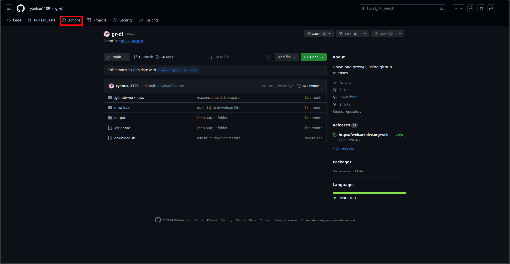

# 下載速度太慢？~~讓 Github 來幫你！~~

## 功能介紹
這是一個貼上網址就把檔案轉存到 Github Releases 的代下載器

## 首次使用說明
1. [登入](https://github.com/login)或[註冊](https://github.com/signup) Github 帳號
1. Fork 此專案

1. 進入本人帳號下 fork 的專案
1. 點擊 ```Actions```

1. 點擊 ```I understand my workflows, go and enable them```

1. 點擊左側的 ```Download and save to Github Releases```
1. 點擊 ```Run workflow```

1. 貼上連結點擊 ```Run workflow``` 就會開始下載了
1. 完成後請到 ```Releases``` 頁面，下載所有檔案（```file.zXX``` 和 ```file.zip```）
1. 全部下載後，對 ```file.zip``` 解壓縮就可以看到檔案了
#### 已經fork過請從第三步開始做